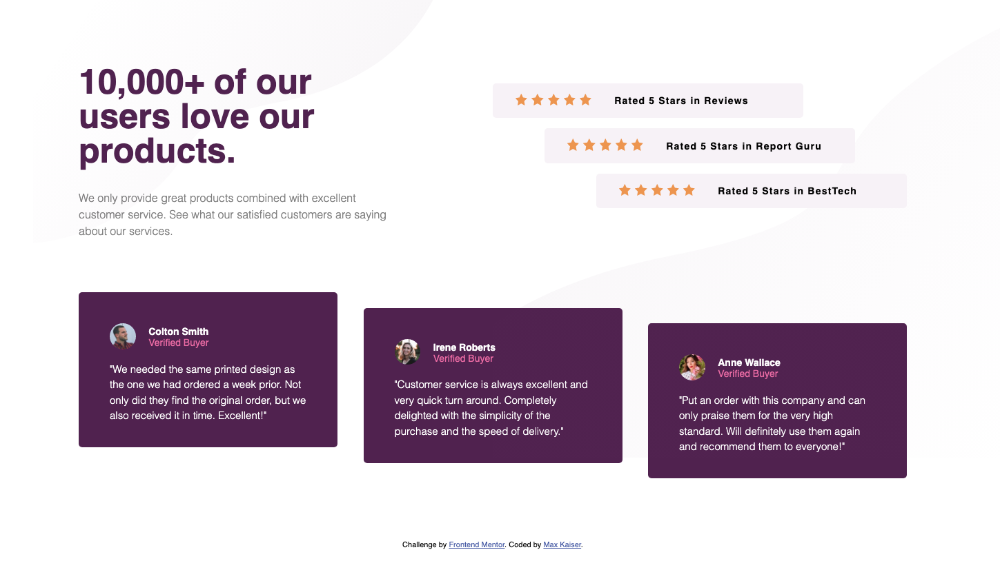

# Frontend Mentor - Social Proof

This is a solution to the Social Proof challenge on Frontend Mentor](Frontend Mentor challenges help you improve your coding skills by building realistic projects. 

### The challenge

Users should be able to:

- View the optimal layout depending on their device's screen size

### Screenshot

### Links

- Solution URL: https://github.com/maxkaiser100/3-Column-Preview.git
- Live Site URL: https://maxkaiser100.github.io/3-Column-Preview/

## My process

Did it mobile-first! Laid out the mobile version, got that right, then used media query for the desktop.

### Built with

- Semantic HTML5 markup
- CSS custom properties
- Flexbox
- CSS Grid

### What I learned

Worked in a lot of grid and responsive grid on this one.

## Author

- Frontend Mentor - @maxkaiser100

